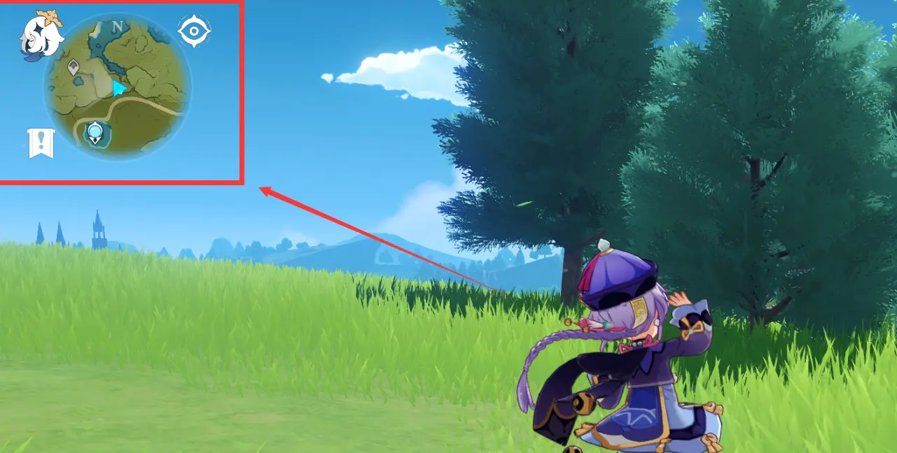
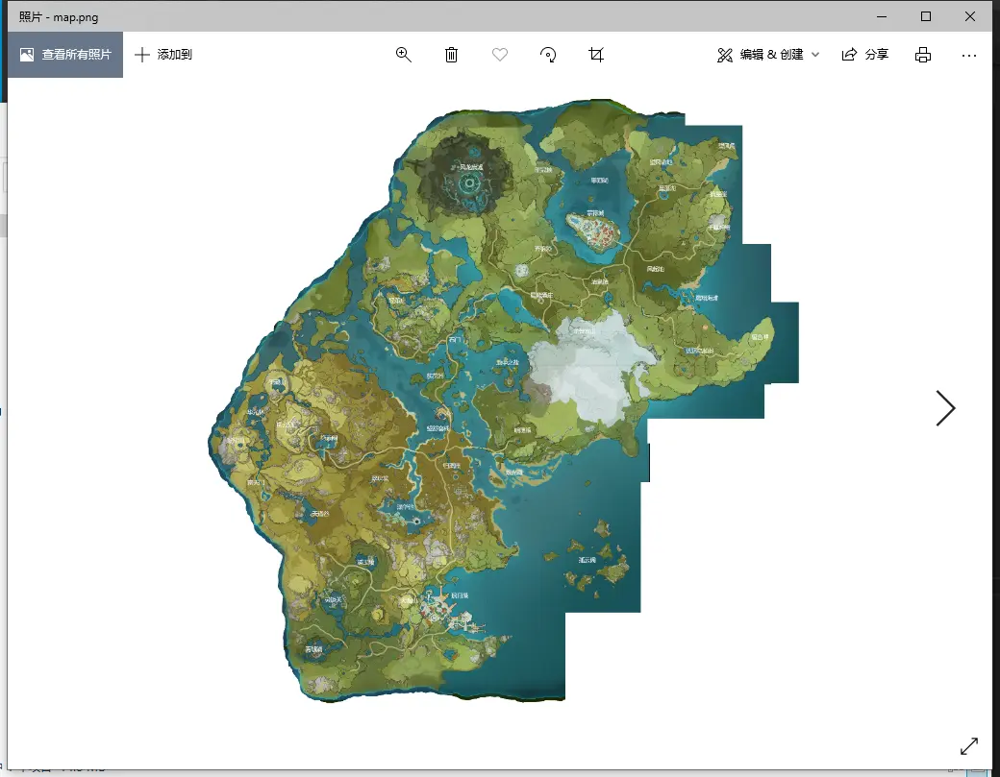

OpenCV版本是3.4.2
Python版本是3.6
pyautogui版本是0.9.51
显示器为1920x1080
(其他像素当然能用，需要自己改)

# 效果
本项目实现了原神游戏中实时位置检测，将会在控制台返回人物所在的位置的（x,y）坐标，对应大地图上的像素点坐标。


# 思路
1.使用OpenCV里面的Flann图片特征匹配，实现用右上角的小地图去匹配保存在本地的大地图





注：地图截屏于原神wiki里的地图，链接
https://wiki.biligame.com/ys/

2.大地图匹非常耗时[将近5秒]，而且吃CPU，所以大地图匹配一次后下次只匹配当前位置的大地图的一个小区域，可以看到第一次很慢，之后就快的多了


3.使用一个小地图模板来实现检测当前是否是在游戏中，避免没有检测到地图也硬要去匹配地图，造成计算资源浪费


# 改进
1.可以不用截屏，obs采集屏幕，启用虚拟摄像头，opencv捕捉这个虚拟摄像头，可以有很好的防检测能力，就是会有不小的延迟
2.截屏也可以全图截屏，然后模板匹配后进行剪裁再规定此后的截屏大小，其实也不错，实现起来不费劲

# 用处？
这个只是检测，是第一步，获得位置后就能做导航，安卓端或者web端，想想一下在手机上可以跟百度地图一样显示当前位置，显示资源位置，规划导航路线，自己录制锄地路线，还是很有意思的，也许有空会做？


# 网盘链接
https://darksuger.lanzous.com/i3omghbfhlg


# 代码贴出来
````
import pyautogui
import os
import sys
import numpy as np
import cv2 as cv
import time

#OpenCV版本是3.4.2
#Python版本是3.6
#pyautogui版本是0.9.51


#设置项：截图的长宽
grapW=330
grapH=250

refreshSP=1

mapPath=os.path.join(sys.path[0],'map.png')
maskPath=os.path.join(sys.path[0],'mask.png')

mapCache=cv.imread(mapPath,0) #读取地图
mask=cv.imread(maskPath,0)#读取识别模板

theGlob=200 #地图剪裁半径
theX=theGlob 
theY=theGlob

largeMapping=True #大地图匹配位，表示是否进行全图匹配
ready=False #主页匹配位,表示当前截取到的画面是否包含地图

while True:
    map=mapCache.copy()
    img = pyautogui.screenshot(region=[0,0,grapW,grapH]) # 截图的x y w h
    img = cv.cvtColor(np.asarray(img),cv.COLOR_RGB2GRAY) # 图片灰度化
    #这个是用来测试的，测试屏幕截图的效果，能出现完整的居中的小地图即可
    #没有双屏可以先截图游戏再用截图测试
    #test(img) 

    try:
        if ready:
            if largeMapping==False:
                #将大地图裁剪后识别，增加匹配速度，减少cpu压力
                map=map[theY-theGlob:theY+theGlob,theX-theGlob:theX+theGlob]
                retX,retY=mapper(map,img)
                if retX!=-1:
                    #区域地图匹配成功
                    theX+=(retX-theGlob)
                    theY+=(retY-theGlob)
                    print((theX,theY))
                    time.sleep(refreshSP)
                else:
                    #区域地图匹配失败
                    print('none')
                    retX,retY=mapper(img,mask)#模板匹配，判断是否截图的是小地图
                    if retX!=-1:
                        largeMapping=True#模板匹配成功，判断已经进行了传送，转大地图匹配
                    else:
                        print('check ready')
                        ready=False
                        time.sleep(1)                     
            else:
                #全图匹配
                retX,retY=mapper(map,img)
                if retX!=-1:
                    theX=retX
                    theY=retY
                    print((theX,theY))
                    largeMapping=False
                else:
                    print('mapper error!')#全图匹配失败？
                    time.sleep(4)
        else:
            #模板匹配，判断是否截图到的图像是小地图
            retX,retY=mapper(img,mask)
            if retX!=-1:
                ready=True
                print('is ready')
            else:
                print('no ready!')
                time.sleep(1)
    except:
        print('???')#匹配算法出错，纯色截图下会出错，捕捉一下不处理。
        time.sleep(1)

def mapper(map,mapping):
    MIN_MATCH_COUNT=10 #设置最低匹配数量为10

    sift=cv.xfeatures2d.SIFT_create() #创建sift检测器
    kp1,des1=sift.detectAndCompute(mapping,None) 
    kp2,des2=sift.detectAndCompute(map,None)
    #创建设置FLAAN匹配
    FLANN_INDEX_KDTREE=0
    index_params=dict(algorithm=FLANN_INDEX_KDTREE, trees=5)
    search_params=dict(checks=50)
    flann=cv.FlannBasedMatcher(index_params,search_params)
    mathces=flann.knnMatch(des1,des2,k=2)
    good=[]
    #过滤不合格的匹配结果，大于0.7的都舍弃
    for m,n in mathces:
        if m.distance<0.7*n.distance:
            good.append(m)
        #如果匹配结果大于10，则获取关键点的坐标，用于计算变换矩阵
    if len(good)>MIN_MATCH_COUNT:
        src_pts=np.float32([kp1[m.queryIdx].pt for m in good]).reshape(-1,1,2)
        dst_pts =np.float32([kp2[m.trainIdx].pt for m in good]).reshape(-1, 1, 2)

        #计算变换矩阵和掩膜
        M,mask=cv.findHomography(src_pts,dst_pts,cv.RANSAC,10.0)
        matchesMask=mask.ravel().tolist()
        #根据变换矩阵进行计算，找到小图像在大图像中的位置
        h,w=img.shape
        pts=np.float32([[0,0],[0,h-1],[w-1,h-1],[w-1,0]]).reshape(-1,1,2)

        dst=cv.perspectiveTransform(pts,M)#从左上逆时针表示的矩阵顶点

        theX=int((dst[0][0][0]+dst[2][0][0])/2)
        theY=int((dst[0][0][1]+dst[2][0][1])/2)#计算坐标点
        
        return theX,theY     
    else:
        return -1,-1
def test(img):
    cv.imshow(img)
    cv.waitKey(0)
````

转载注明原帖，禁止商用