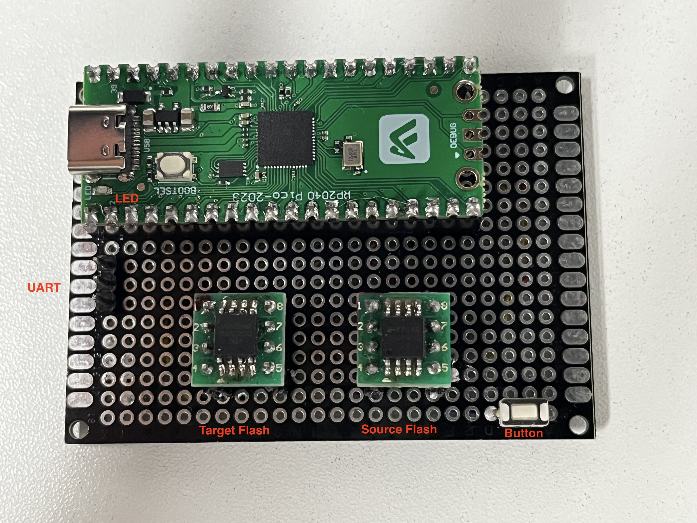
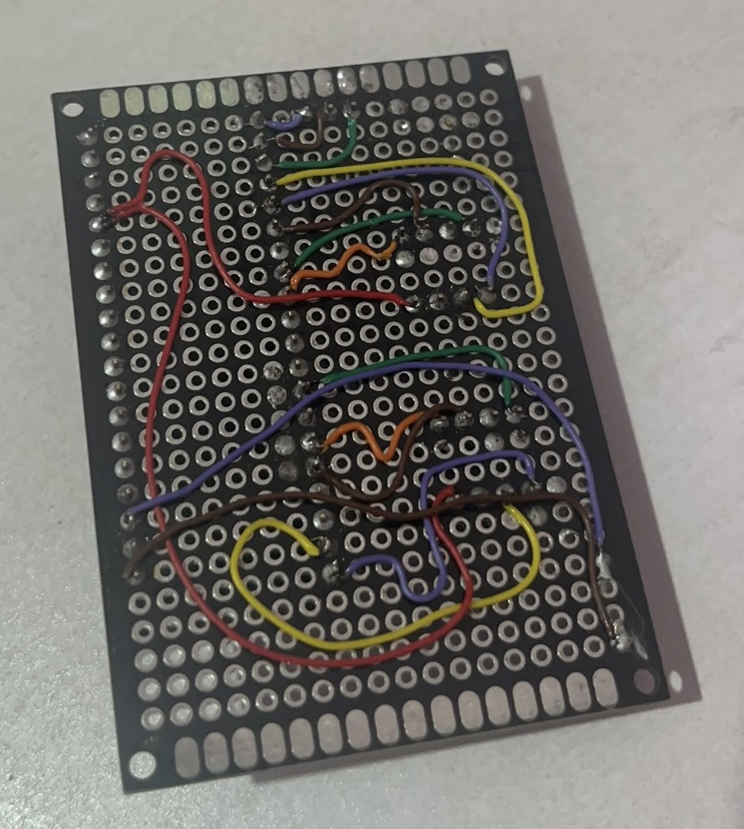

## 背景

学习pico和rtthread的过程中, 恰好需要大量烧录spi norflash, 所以顺便开发了该功能

## 成果

如图:

* 左侧是待复制的flash, 右侧是提供原始数据的flash
* 按下按钮, led灯常亮, 开始数据拷贝
  * 源代码中设置的是从源flash的1M开始拷贝2M大小的数据到目的flash
  * 拷贝成功, led灯熄灭, 拷贝失败, led灯闪烁
* uart 连接(115200hz)后, 可以执行一些命令
  * 执行 cpf   可以拷贝数据, 是完全拷贝, 会把源flash的所有数据都拷贝到目标flash

## 开发过程

### 关于树莓派pico

使用了它两个spi控制器; 其实根据spi的片选特性, 只需要一个spi控制器就可以, 但因为手工焊接更简单一些, 所以用了两个.

效果如图, 个人觉得效果还挺好的, 焊了一个多小时.

### 关于rt-thread

国人开发的rtos实时操作系统, 被同事安利的, 因为pico刚好在它的支持列表里, 所以开始了解它

rt-thread有sfud flash驱动, 这个是我选择它最重要的原因, 它会读取flash内厂商保存的通信参数, 自动匹配各个不同型号的flash, 节省大量的开发时间. 可以说没有这个驱动, 都不会去想做这个项目.

其实rt-thread是支持tinyusb的, 这样就可以走usb-cdc协议通过pico的usb口直接发送串口数据了. 但实际勾选编译后并没有效果, 花了不少时间最后也没有搞成. 好像是在menuconfig里勾选完, 还要在代码里做一些工作才能启用, 后续有空了再解决这个问题.

rt-thread相比于linux内核, 给我的感觉是不够傻瓜化(也可能我是在linux编译, 纯字符方式开发导致的). 比如提到的tinyusb的问题, 比如还需要配置env环境, 然后用pkgs install下载库啥的,  给我的感觉挺别扭的, 也很影响初学者的信心.

### 代码方面的一些思路

* 使用INIT_COMPONENT_EXPORT宏指定的函数, 会在系统初始化阶段调用, 在这里提前申请了 4K x 2 大小的内存用来存放两个flash的数据

  因为不可能一次就吧flash数据都读回来, 所以一次只读4K大小

* 烧录flash的过程

  由于数据一般只占flash的小部分区域, 所以代码中先读回源flash 4K数据, 再读目标flash 4k数据, 对比两个数据是否一致, 一致则跳过. 这样极大节约了时间, 而且可以延长flash的使用寿命.

  烧录完成后, 统一再检查一遍flash的内容, 保证写入数据一致.